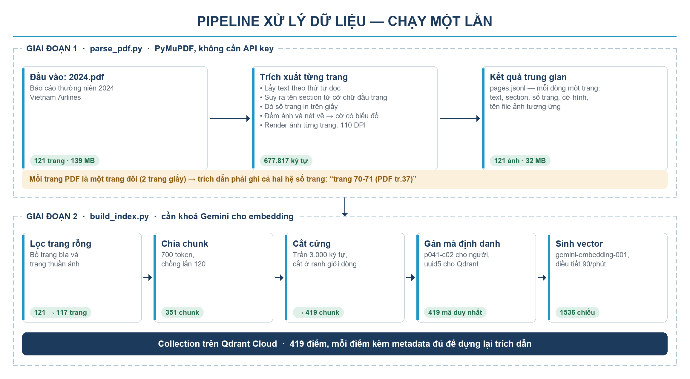

# VNA Technical Chatbot — POC Multi-Agent RAG

Chatbot nội bộ tra cứu **Báo cáo thường niên 2024 — Vietnam Airlines** (121 trang PDF),
trả lời kèm citation dẫn được về đúng trang tài liệu, không bịa khi thiếu bằng chứng.

| Thành phần | Công nghệ |
|---|---|
| Framework agent/RAG | LlamaIndex |
| LLM | `google/gemini-2.5-flash` + `google/gemini-2.5-flash-lite` qua **OpenRouter** |
| Embedding | Gemini `gemini-embedding-001` (1536 chiều) |
| Vector DB | Qdrant Cloud (Sydney) — 419 vector |
| Rerank | Cohere `rerank-v3.5` |
| Backend | FastAPI |
| Frontend | HTML/CSS/JS thuần |

---

## 1. Kiến trúc

![Kiến trúc hệ thống]

**Hai agent tách bạch thật sự:**
`Orchestrator` ([app/agents/orchestrator.py](app/agents/orchestrator.py)) không hề import
Qdrant/Cohere — muốn có bằng chứng thì bắt buộc phải gọi `RagAgent`.
`RagAgent` ([app/agents/rag_agent.py](app/agents/rag_agent.py)) không xử lý chào hỏi hay
câu ngoài phạm vi. Mỗi agent có `name` riêng và xuất hiện riêng trong trace hiển thị trên UI.

### Cấu trúc thư mục

```
app/
  config.py              # đọc .env, chọn model theo nhà cung cấp đang bật
  session.py             # lịch sử hội thoại (RAM) — phục vụ follow-up
  vector_store.py        # factory Qdrant: Cloud hoặc bản nhúng
  server.py              # FastAPI
  ingest/
    parse_pdf.py         # PDF → text + section + số trang + ảnh trang
    build_index.py       # chunk → embed Gemini → Qdrant
  agents/
    llm.py               # factory LLM (OpenRouter/Gemini) + parse JSON
    rag_agent.py         # AGENT 2
    orchestrator.py      # AGENT 1
scripts/                 # bộ kiểm thử offline và bộ test của đề bài
web/                     # giao diện chat
docs/                    # sơ đồ kiến trúc và pipeline
data/                    # sinh ra khi ingest, không commit
  parsed/pages.jsonl     # kết quả parse
  pages/page_XXX.jpg     # ảnh từng trang, dùng preview citation
```

---

## 2. Chạy local

### 2.1. Cài đặt

```bash
cd D:\Sotatek\vna-chatbot
python -m venv .venv
.venv\Scripts\python.exe -m pip install -r requirements.txt
```

### 2.2. Lấy API key

| Key | Lấy ở đâu |
|---|---|
| `OPENROUTER_API_KEY` | https://openrouter.ai/keys — dùng cho chat LLM |
| `GEMINI_API_KEY` | https://aistudio.google.com/apikey — **chỉ dùng cho embedding** |
| `QDRANT_URL` + `QDRANT_API_KEY` | https://cloud.qdrant.io → tạo cluster Free 1GB |
| `COHERE_API_KEY` | https://dashboard.cohere.com/api-keys (trial key) |

Copy `.env.example` thành `.env` rồi điền vào.

**Không có tài khoản Qdrant Cloud?** Bỏ trống `QDRANT_URL` và đặt `QDRANT_PATH=data/qdrant`.
Qdrant sẽ chạy nhúng ngay trong tiến trình Python, lưu ra thư mục trên đĩa — cùng thư viện
`qdrant-client`, cùng API, chỉ khác chỗ lưu trữ. Không cần Docker, không cần tài khoản.
Lưu ý: thư mục dữ liệu bị khoá bởi một tiến trình duy nhất, nên **không chạy `build_index`
và `uvicorn` cùng lúc**.

### 2.3. Ingest tài liệu



```bash
.venv\Scripts\python.exe -m app.ingest.parse_pdf
```
→ 121 trang, 677.817 ký tự → `data/parsed/pages.jsonl` + 121 ảnh trang (~32 MB).
Bước này **không cần API key** và chỉ cần chạy một lần.

```bash
.venv\Scripts\python.exe -m app.ingest.build_index --recreate
```
→ chunk (700 token, overlap 120) → embed bằng Gemini → đẩy lên collection Qdrant.
Thêm `--limit 10` để thử nhanh với 10 trang đầu.

### 2.4. Chạy server

```bash
.venv\Scripts\python.exe -m uvicorn app.server:app --host 0.0.0.0 --port 8000
```

Mở http://localhost:8000 — kiểm tra nhanh trạng thái tại http://localhost:8000/api/health
(báo rõ key nào chưa cấu hình, Qdrant có bao nhiêu points).

### 2.5. Demo qua ngrok

```bash
ngrok http 8000
```

Cài ngrok tại https://ngrok.com/download, rồi `ngrok config add-authtoken <token>`.
Chỉ cần tunnel **một port duy nhất** vì FastAPI serve luôn cả frontend và ảnh trang PDF.

---

## 3. Cơ chế citation

Mỗi chunk mang metadata đủ để truy ngược về tài liệu:

| Field | Ví dụ | Ý nghĩa |
|---|---|---|
| `source_file` | `Bao cao thuong nien 2024 - Vietnam Airlines.pdf` | tên file nguồn |
| `page_label` | `78-79` | **số trang in trên giấy** |
| `page_index` | `41` | số trang trong file PDF, dùng mở ảnh preview |
| `section` | `2.3.3. Chương trình khách hàng thường xuyên (Lotusmile)` | section |
| `chunk_id` | `p041-c02` | anchor nội bộ: trang 41, chunk 2 |
| `has_figure` | `true` | trang có hình/biểu đồ/dashboard |
| `score` | `0.9283` | điểm rerank Cohere |

> ⚠️ Mỗi trang PDF của báo cáo này là **một spread 2 trang giấy**, nên citation ghi
> `trang 78-79 (PDF tr.41)`. Đây là lý do cần cả `page_label` lẫn `page_index`.

Trên UI, marker `[1]` trong câu trả lời và card citation đều bấm được → panel bên phải
mở đúng ảnh trang PDF đó qua `GET /api/page/{page_index}`.

**Chống citation giả:** sau khi Gemini sinh câu trả lời, hệ thống parse các marker `[n]`
thực sự xuất hiện trong text và **chỉ trả về những citation được dùng thật**
(`rag_agent.py`, bước B5). Frontend cũng chỉ biến `[n]` thành nút bấm nếu marker đó có
citation tương ứng.

**Chống hallucinate:** ba lớp
1. Orchestrator không route sang RAG với `small_talk` / `out_of_scope` → không có cửa sinh citation.
2. Sau rerank, chunk có điểm dưới `RERANK_MIN_SCORE` bị loại; nếu không còn chunk nào → trả về "không đủ bằng chứng", không gọi LLM sinh câu trả lời.
3. Prompt bắt buộc model trả sentinel `<<INSUFFICIENT_EVIDENCE>>` khi bằng chứng không đủ;
   phép dò chịu được cả biến thể có dấu tiếng Việt.

---

## 4. Xử lý follow-up

Orchestrator phân biệt hai loại follow-up qua cờ `needs_retrieval`:

- **Cần thông tin mới** (`"còn mảng quốc tế thì sao?"`) → orchestrator chuẩn hoá thành câu
  hỏi độc lập (`standalone_question`, thay đại từ bằng đối tượng cụ thể) rồi chuyển sang RAG
  agent retrieve lại. RAG agent bỏ qua bước rewrite của chính nó để không tốn thêm 1 lượt LLM.
- **Chỉ diễn đạt lại** (`"tóm tắt ngắn hơn giúp tôi"`) → **dùng lại evidence của lượt trước**,
  không gọi Qdrant/Cohere, giữ nguyên marker `[n]`. Vừa nhanh vừa không đổi nguồn giữa chừng.

---

## 5. API

| Endpoint | Mô tả |
|---|---|
| `POST /api/chat` | `{message, session_id?}` → `{answer, intent, citations[], grounded, trace[], session_id}` |
| `POST /api/reset` | xoá lịch sử một session |
| `GET /api/page/{n}` | ảnh trang PDF thứ n (JPEG) |
| `GET /api/health` | trạng thái key, số ảnh trang, số points trong Qdrant |

---

## 6. Kiểm thử offline (không tốn quota)

Hai script chạy được bất kỳ lúc nào, **không gọi Gemini/Cohere/Qdrant Cloud**:

```bash
.venv\Scripts\python.exe scripts\smoke_offline.py
```
Chạy pipeline ingest thật trên Qdrant in-memory với embedding giả — kiểm tra chunking,
tính duy nhất của `chunk_id`, giới hạn độ dài chunk, và metadata có sống sót qua Qdrant không.

```bash
.venv\Scripts\python.exe scripts\test_agents_offline.py
```
Thay LLM/retriever/reranker bằng bản giả để test **logic định tuyến** — đúng những tiêu chí
đề bài chấm: small_talk/out_of_scope có gọi retrieval không, follow-up có dùng lại evidence
không, thiếu bằng chứng có bịa citation không, có lọc đúng citation được trích dẫn không.

Sau khi đã ingest, chạy bộ test của đề bài — **không cần server đang chạy**:

```bash
.venv\Scripts\python.exe scripts\run_testcases.py --inprocess
```

Bỏ `--inprocess` nếu muốn test qua HTTP với server đang chạy ở `--url`.

### Kết quả gần nhất — 28/08/2026, **8/8 PASS**

| Ca | intent | citation | Ghi chú |
|---|---|---|---|
| A1 Chào hỏi | `small_talk` | 0 | không gọi retrieval |
| A2 Tra tài liệu | `document_qa` | 8 | trang 108–113, mục 2.11 Công nghệ thông tin |
| A3 Hỏi nối tiếp | `follow_up` | 8 | giữ đúng nguồn của A2, không truy hồi lại |
| A4 Ngoài phạm vi | `out_of_scope` | 0 | không citation giả |
| A5 Thiếu bằng chứng | `out_of_scope` | 0 | không bịa |
| A6 So sánh | `document_qa` | 2 | trang 60–61 và 68–69 |
| B1 Phát triển bền vững | `document_qa` | 5 | trang 140–145, rerank 0.94–0.97 |
| **B2 Thị phần** | `document_qa` | 1 | **nội địa 45,7% · quốc tế 18,0%** — đã đối chiếu bảng gốc trang 70–71 |

Độ trễ Qdrant Sydney đo được: **152 ms**. Ingest 419 chunk: **337 giây**.
Chi phí OpenRouter cho toàn bộ quá trình phát triển và test: **~0,05 USD**.

---

## 7. Quota Gemini free tier

Free tier giới hạn **20 request/ngày cho mỗi model** (`GenerateRequestsPerDayPerProjectPerModel`).
Lưu ý các alias như `gemini-flash-latest` **dùng chung túi quota** với model thật mà nó trỏ tới.

Vì vậy hệ thống tách hai model:

| Biến | Dùng cho | Mặc định |
|---|---|---|
| `GEMINI_FAST_MODEL` | phân loại intent, query rewrite | `gemini-flash-lite-latest` |
| `GEMINI_CHAT_MODEL` | sinh câu trả lời, tổng hợp cuối | `gemini-3.6-flash` |

Số lượt LLM tiêu tốn cho mỗi tin nhắn:

| Loại câu hỏi | fast model | chat model |
|---|---|---|
| small_talk / out_of_scope | 1 | 1 |
| document_qa | 1 | 2 (synthesize + compose) |
| follow_up chỉ diễn đạt lại | 1 | 1 |
| thiếu bằng chứng (dưới ngưỡng rerank) | 1 | 0 |

Hết quota thì đổi `GEMINI_CHAT_MODEL` sang model khác còn lượt (`gemini-3.5-flash`,
`gemini-3.1-flash-lite`…) — quota tính riêng từng model. Muốn hết lo thì bật billing.

Embedding có quota riêng và rất nhẹ: toàn bộ 419 chunk chỉ tốn **27 request**.

---

## 8. Tham số tinh chỉnh (trong `.env`)

| Biến | Mặc định | Ghi chú |
|---|---|---|
| `RETRIEVE_TOP_K` | 20 | số chunk lấy từ Qdrant trước khi rerank |
| `RERANK_TOP_N` | 5 | số chunk giữ lại sau rerank |
| `RERANK_MIN_SCORE` | 0.05 | dưới ngưỡng này coi như không đủ bằng chứng |
| `EMBED_DIM` | 1536 | số chiều embedding Gemini |

Cohere trial key có rate limit thấp → giữ `RETRIEVE_TOP_K` ở mức 20, đừng đẩy lên cao.

---

## 9. Hạn chế đã biết

- **Bảng số liệu trong PDF extract ra bị xáo thứ tự cột/hàng.** Báo cáo thường niên trình bày
  dạng infographic nên text layer không giữ được quan hệ hàng–cột.
  *Thực tế khi chạy:* test B2 (thị phần nội địa vs quốc tế) **vẫn trả đúng** 45,7% / 18,0%,
  vì dòng tiêu đề và dòng số liệu đều sống sót nguyên vẹn nên model ghép lại được. Nhưng đây
  là may mắn của riêng bảng đó, **không nên coi là bảo đảm cho mọi bảng khác** trong tài liệu.
  *Hướng xử lý triệt để:* thêm vision pass — cho Gemini đọc ảnh các trang có bảng/dashboard,
  chuyển thành markdown rồi ghép vào text trước khi chunk.
- Trang 1, 2, 120, 121 gần như không có text (bìa/ảnh) nên bị bỏ qua khi ingest.
- Session lưu trong RAM → restart server là mất lịch sử hội thoại.
- `gemini-2.5-flash` mà đề bài chỉ định trả 404 *"no longer available to new users"* khi gọi
  **thẳng** bằng key AI Studio của tài khoản mới. Đi qua OpenRouter thì dùng lại được đúng
  model này. Đặt `USE_OPENROUTER=0` sẽ quay về gọi thẳng Gemini và khi đó phải chọn model
  khác (`gemini-3.6-flash`). Embedding luôn gọi thẳng Gemini vì OpenRouter không phục vụ
  embedding.
- Follow-up kiểu "ngắn hơn nữa" lần thứ hai vẫn rút gọn từ câu trả lời **gốc**, không phải
  từ bản đã rút gọn. Cố ý làm vậy để citation không trôi khỏi bằng chứng ban đầu.
- `RERANK_MIN_SCORE = 0.05` giữ nguyên sau khi chạy thật; các chunk đúng đều đạt 0.83–0.97
  nên ngưỡng này thoải mái. `RERANK_TOP_N` đã nâng 5 → 8 vì câu so sánh (A6) cần nhiều nguồn.
- Sentinel báo thiếu bằng chứng dùng chuỗi ASCII `<<INSUFFICIENT_EVIDENCE>>`. Bản tiếng Việt
  trước đó từng bị model trả về **có dấu** (`KHÔNG_DU_...`), khiến phép so sánh trượt và hệ
  thống tưởng câu trả lời có căn cứ — cơ chế an toàn thất bại theo hướng mở. Hàm
  `says_not_found()` giờ bỏ dấu trước khi so, và xử lý riêng chữ `đ` vì Unicode coi nó là
  chữ cái riêng chứ không phải `d` có dấu.
- Bước sinh câu trả lời để `temperature = 0.0`. Ở 0.1 từng gặp cùng câu hỏi, cùng bằng chứng
  mà lúc trả lời lúc từ chối — A6 chỉ đạt 2/3 lần. Về 0.0 thì ổn định 4/4.
